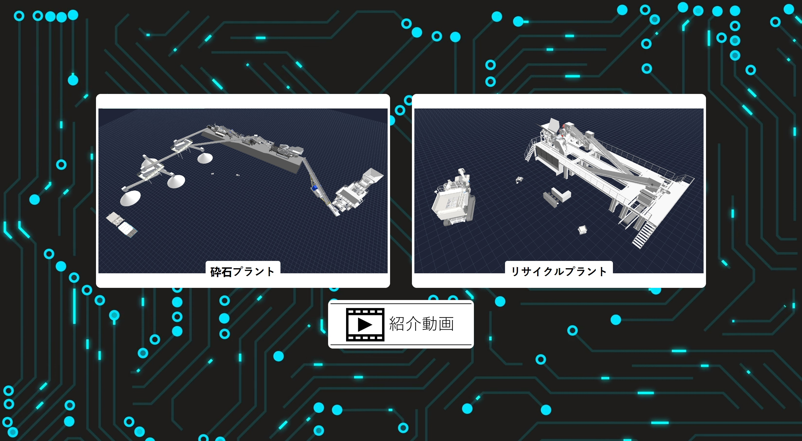
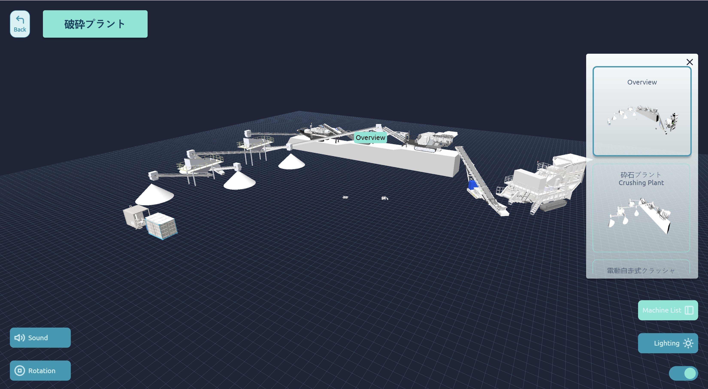
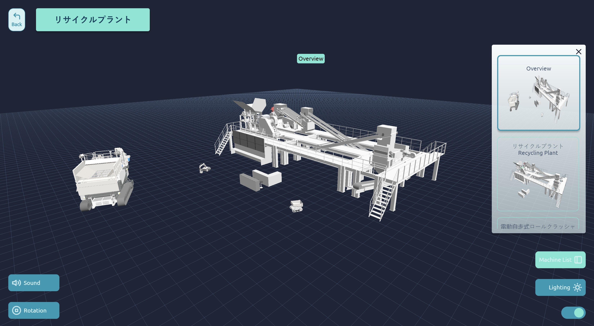
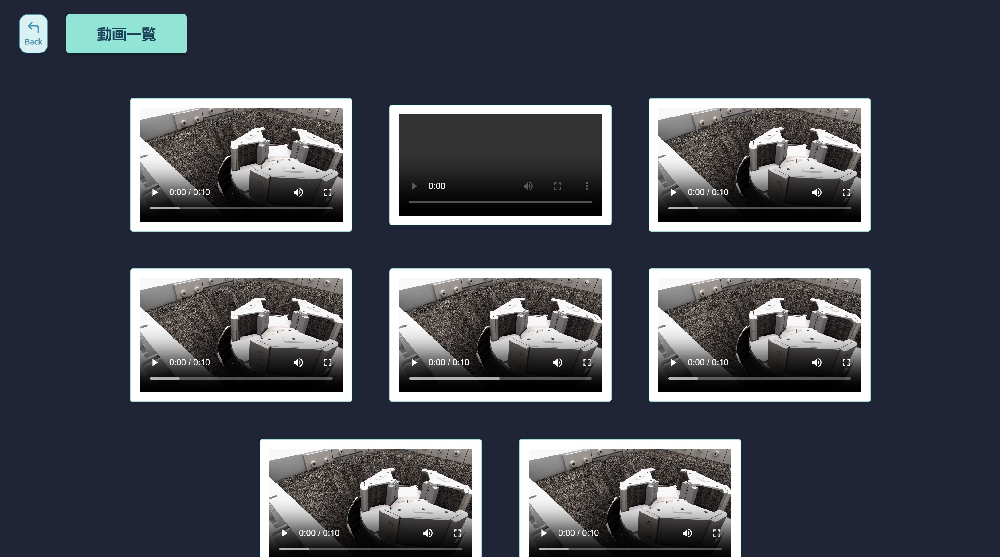

# Smart Presentation Hokkaido Showroom

Development of "Smart Presentation" Project by NIW &amp; ITB De Labo, focused on Hokkaido Showroom

## Table of Contents

- [About The Project](#about-the-project)
- [Technologies Used](#technologies-used)
- [Data Configuration](#data-configuration)
- [Documentation](#Documentation)

## About The project


Smart Presentation Hokkaido Showroom is a website that displays interactive 3D file of NIW products. User can zoom, change lightning, and rotate the 3D file displayed.

## Technologies Used

- 

- 

- 

- 

- 

## Data Configuration

#### Object Information

Update the information of each object in `data/data.json` attribute `info`.

#### GLB File

Put the `.glb` file in folder `/files/glb` and update the file path value in `data/data.json` in the attribute `glb_file` for the object. The attribute value should follow this template.

```
files/glb/[glb-file-name].glb
```

#### Audio

Put the `.mp3` file in folder `/audio` and update the file path value in `data/data.json` in the attribute `audio_link` for the object. The attribute value should follow this template.

```
./audio/[audio-file-name].mp3
```

#### PDF

Put the `.pdf` file in folder `/files/pdf` and update the pdf path value in `data/data.json` in the attribute `pdf_link` for the object. If there are no pdf for the object, delete the `pdf_link` attribute. The attribute value should follow this template.

```
./files/pdf/[pdf-file-name].pdf
```

#### Video

Put the `.mp4` file in folder `/files/video` and update the video path value in `data/data.json` in the attribute `video_link` for the object. If there are no video for the object, delete the `video_link` attribute. The attribute value should follow this template.

```
./files/video/[video-file-name].mp4
```

#### Information Image

Put the `.jpg`, `.jpeg`, `.png` file in folder `/files/img_preview` and update the image path value in `data/data.json` in the attribute `info_img` for the object. If there are no image for the object, delete the `info_img` attribute. The attribute value should follow this template.

```
./files/img/[img-file-name].jpg
./files/img/[img-file-name].jpeg
./files/img/[img-file-name].png
```

## Documentation

#### Home Page


#### Crushing Plant Page



#### Recycling Plant Page



#### Company Video Page


