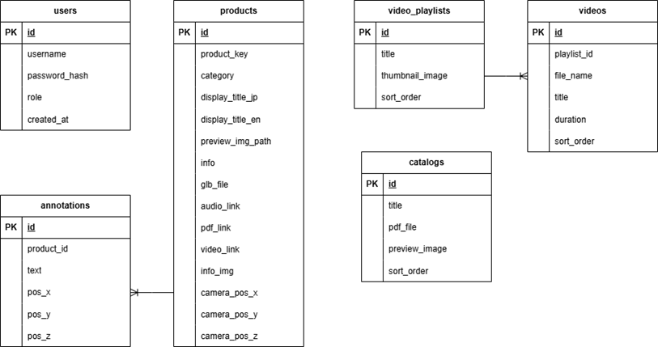

# Smart Presentation Hokkaido Showroom - Documentation


## System Requirements

**Server Requirements:**
- PHP >= 8.0
- MySQL/MariaDB >= 5.7
- Apache/Nginx Web Server
- 500MB+ disk space for media files

**PHP Extensions:**
```ini
extension=pdo_mysql
extension=mbstring
extension=gd
extension=fileinfo
extension=json
```

**Client Requirements:**
- Modern web browser (Chrome, Firefox, Edge - latest version)
- WebGL support for 3D rendering

---

## Quick Start

### 1. Clone Repository
```bash
git clone https://github.com/itbdelaboprogramming/Smart_Presentation_Hokkaido_Showroom.git
cd Smart_Presentation_Hokkaido_Showroom
```

### 2. Database Setup
1. Start XAMPP (Apache + MySQL)
2. Open phpMyAdmin: `http://localhost/phpmyadmin`
3. Create database: `hokkaido_showroom_db`
4. Import: `database/schema.sql`

### 3. Configuration
Edit `config.php` if needed (default configured for localhost):
```php
$db_host = 'localhost';
$db_user = 'root';
$db_pass = '';  // Empty for XAMPP default
$db_name = 'hokkaido_showroom_db';
```

### 4. File Permissions
Ensure writable (755 or 777):
```
files/glb/
files/img/
files/pdf/
files/video/
audio/
```

### 5. Access Application
```
Login: admin / admin123
```

### 6. Data Migration (Optional)
If database is empty or needs reset:
```
http://localhost/Smart_Presentation_Hokkaido_Showroom/migrate_data.php
```

---

## Database Structure

The application uses 6 relational tables:



**Main Tables:**
- `users` - Authentication and roles
- `products` - 3D product information
- `annotations` - 3D annotation coordinates
- `catalogs` - PDF catalog management
- `video_playlists` - Video playlist organization
- `videos` - Individual video files

For detailed schema information, see `database/schema.sql`

---

## Troubleshooting

### Database Connection Failed
```php
// Verify config.php:
$db_pass = '';  // Empty for XAMPP
$db_host = 'localhost';
```

### File Upload Failed
```ini
// Check php.ini or .htaccess, increase limits:
upload_max_filesize = 100M
post_max_size = 100M
max_execution_time = 300
```

### Session Not Working
```bash
# Verify session directory is writable:
C:\xampp\tmp\  (Windows)
/tmp/          (Linux/Mac)
```

### 3D Model Not Displaying
- Check file path in database: `SELECT glb_file FROM products;`
- Verify file exists in `files/glb/`
- Check browser console for errors

---

## Project Structure

```
Smart_Presentation_Hokkaido_Showroom/
├── api/                    # REST API endpoints
│   ├── catalog_api.php
│   ├── video_api.php
│   └── product_api.php
├── auth/                   # Authentication handlers
│   ├── login_process.php
│   └── logout.php
├── middleware/             # Access control
│   ├── auth_check.php
│   └── admin_check.php
├── pages/                  # Application pages
├── js/                     # JavaScript modules
├── style/                  # CSS stylesheets
├── files/                  # Uploaded media files
├── database/               # Database schema
├── docs/                   # Documentation
│   ├── README.md          (this file)
│   ├── PROJECT_UPDATES.md (detailed technical report)
│   └── ERD.png            (database diagram)
├── config.php             # Database configuration
└── index.php              # Application router
```

---

## Documentation

**For detailed technical information, see:**
- [PROJECT_UPDATES.md](PROJECT_UPDATES.md) - Complete technical report with:
  - Feature implementation details
  - API documentation
  - Security implementation
  - Testing notes
  - Future enhancements

**Default Credentials:**
```
Username: admin
Password: admin123
```

---

## Support

**Database Schema:** `database/schema.sql`  
**Technical Report:** `docs/PROJECT_UPDATES.md`

---

**Last Updated:** December 2025
